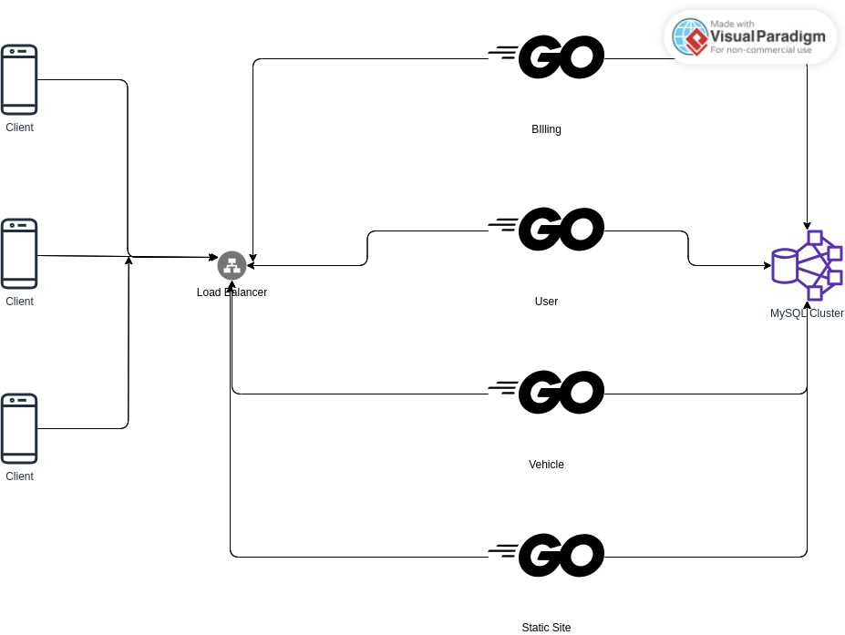

# CNAD Assignment 1
## Description
In an era marked by sustainable transportation and shared economies, electric carsharing platforms have emerged as a cornerstone of modern urban mobility. This project aims to design and implement a fully functional electric car-sharing system using **Go**, with features catering to diverse user needs and real-world application scenarios. With an emphasis on practical and scalable solutions, the system includes user membership tiers, promotional discounts, and an accurate billing mechanism.
## Technologies used
- HTML
- CSS
- JS
- Bootstrap
- jQuery
- Go
- Docker 
- Kubernetes
## Diagram

## Design Considerations
Using the microservice architecture, I have decomposed the projects into each components, running as a seperate instance for reliability, and seperate scaling using Kubernetes (in progress). Billing, Vehicle, User and hosting the Static Site are a seperate instance. The database is centralised, MySQL Cluster. Each of the Microservice will contact the database cluster. The end goal is for all to be accessed as `https://{domainname}`, using a Kubernetes Load Balancer, with HTTP routing to each of the microservice. But now each of the microservice resides on a different port on the same machine.
## Steps (Without Kubernetes)
1. Set up MySQL Database, copy the `images` into `/var/lib/mysql` on a Linux machine, or under `C:\Program Files\MySQL\MySQL Server 8.0` for Microsoft Windows machine.
2. Set up the [Vehicle Insert](./databases/insertveh.sql) script, to point to the correct image folder.
3. Run the [Initial Database](./databases/setup.sql) script, then followed by the `add*.sql` scripts. Lastly, execute the [Vehicle Insert](./databases/insertveh.sql) script.
4. Setup the `.env` files per the `example.env` in each of the services folder, in each of the services, fill in Database Credentials for MySQL.
5. Open up 4 terminals, or use `screen` in Linux to use a single Terminal.
6. Go into [Services](./services), and run the respective `.go` files.
## Steps (Kubernetes/Docker)
TBD